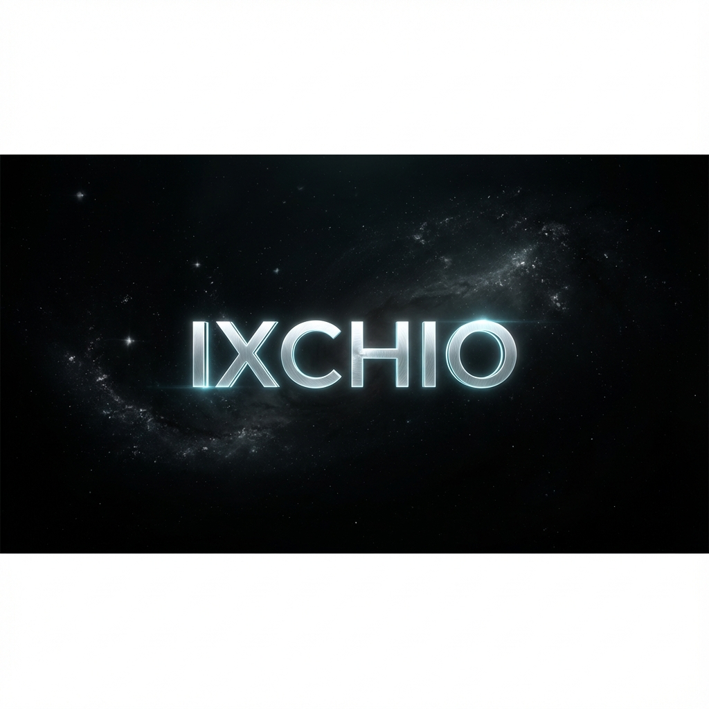

<p align="center">
  
</p>

<p align="center">
  <a href="https://github.com/ixchio"></a>
  <a href="https://pypi.org/user/ixchio/"></a>
  <a href="mailto:amankumarpandeyin@gmail.com"></a>
  <a href="https://linkedin.com/in/amanxxpandey"></a>
</p>

<br>

<p align="center">
  
</p>

<p align="center">
  <strong>Founding Member, <a href="https://github.com/OpenHands">OpenHands Champions Program</a></strong> (< 10 people globally)<br>
  2 packages on PyPI · 17+ merged PRs across 8 open-source projects · Available immediately
</p>

<br>


<br>

## `> cat open_source.log`

**17 merged PRs** to mass prod codebases. Security patches, perf fixes, new features. Not docs. Not typos.

| Project | ★ | PRs | What I shipped |
|:--------|--:|:---:|:---------------|
| [**OpenHands SDK**](https://github.com/OpenHands/software-agent-sdk) | 672 | **9** | Async hooks · thread-safe init · file-based locking · agent pause/resume · early stopping · DeepSeek v3.2 · configurable health checks |
| [**Astro**](https://github.com/withastro/astro) | 58.8k | **2** | CSS double-bundling fix → shipped in `v5.16.11` · O(n²) → O(n) memory alloc |
| [**mem0**](https://github.com/mem0ai/mem0) | 54k | **1** | Fixed missing `text_lemmatized` in AsyncMemory |
| [**Superglue**](https://github.com/superglue-ai/superglue) | 2k | **1** | SSRF prevention — URL validation hardening |
| [**Multigres**](https://github.com/multigres/multigres) | 2.1k | **1** | Safe port range for local Postgres clusters |
| [**Motus**](https://github.com/lithos-ai/motus) | 332 | **1** | Fixed base64 image passthrough in LLM clients |
| [**Polpo**](https://github.com/lumea-labs/polpo) | — | **1** | SSE event subscription + recursive secret redaction |
| [**OpenHands CLI**](https://github.com/OpenHands/OpenHands-CLI) | 162 | **1** | Tab navigation UX in TUI |

<details>
<summary><strong>⏳ Active PRs under review</strong></summary>
<br>

| Project | ★ | PR |
|:--------|--:|:---|
| [**Gemini CLI**](https://github.com/google-gemini/gemini-cli) | 102k | Signal forwarding, UI throttle, env config coercion · [3 PRs](https://github.com/google-gemini/gemini-cli/pulls/ixchio) |
| [**Laminar**](https://github.com/lmnr-ai/lmnr) | 2.8k | Scheduler checkpoint race condition fix |
| [**OpenHands CLI**](https://github.com/OpenHands/OpenHands-CLI) | 162 | Planning mode + AWS IAM Bedrock support |

</details>

<br>


<br>

## `> ls -la ./projects`

| Project | What it does | |
|:--------|:-------------|:-:|
| [**agent-vcr**](https://github.com/ixchio/agent-vcr) | Time-travel debugging for AI agents. Record, rewind, edit state, resume. | [](https://pypi.org/project/ai-agent-vcr) |
| [**n0x**](https://github.com/ixchio/n0x) | Full AI stack in one browser tab. Zero backend. WebGPU + Pyodide. |  |
| [**ragbox-core**](https://github.com/ixchio/ragbox-core) | RAG in 3 lines. Auto-reranking, auto-streaming. No LangChain. | [](https://pypi.org/project/ragbox-core) |
| [**agent-sandbox-runtime**](https://github.com/ixchio/agent-sandbox-runtime) | Docker sandbox with 4-agent swarm (Architect · Coder · Critic · Security). |  |
| [**tas**](https://github.com/ixchio/tas) | Mount Telegram as encrypted cloud storage. Free. FUSE-based. |  |
| [**GroqCoder**](https://github.com/ixchio/GroqCoder) | AI coding platform on Groq LPU. Sub-2s code generation. |  |
| [**AutoPR-AI**](https://github.com/ixchio/AutoPR-AI) | Reads any codebase, ships production-ready PRs autonomously. |  |
| [**web-mcp**](https://github.com/ixchio/web-mcp) | MCP server with RAG pipeline. Claude Desktop + Cursor. |  |
| [**go-resilient-commerce**](https://github.com/ixchio/go-resilient-commerce) | Anti-fragile distributed order engine. Zero data loss. |  |

<br>


<br>

## `> neofetch --stack`

<p align="center">
  
</p>

```
 ╭──────────────────────────────────────────────────────────╮
 │  Languages      Python · TypeScript · Go · JavaScript    │
 │  AI/ML          LangGraph · LangChain · RAG · Agents     │
 │  Backend        FastAPI · Node.js · gRPC                  │
 │  Frontend       React · Next.js · WebGPU                  │
 │  Infra          Docker · K8s · AWS · Postgres · Redis     │
 ╰──────────────────────────────────────────────────────────╯
```

<br>


<br>

## `> htop`

<p align="center">
  
  
</p>

<p align="center">
  
</p>

<br>


<br>

<p align="center">
  
</p>

<br>

<p align="center">
  <strong>Available immediately</strong> · Open to <strong>AI engineer / founding engineer / AI infrastructure</strong> roles<br><br>
  <a href="mailto:amankumarpandeyin@gmail.com"></a>
  <a href="https://linkedin.com/in/amanxxpandey"></a>
  <a href="https://github.com/ixchio"></a>
</p>
